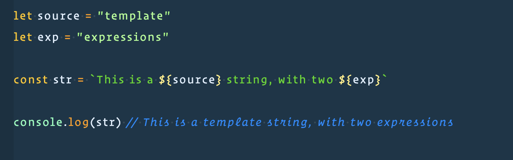
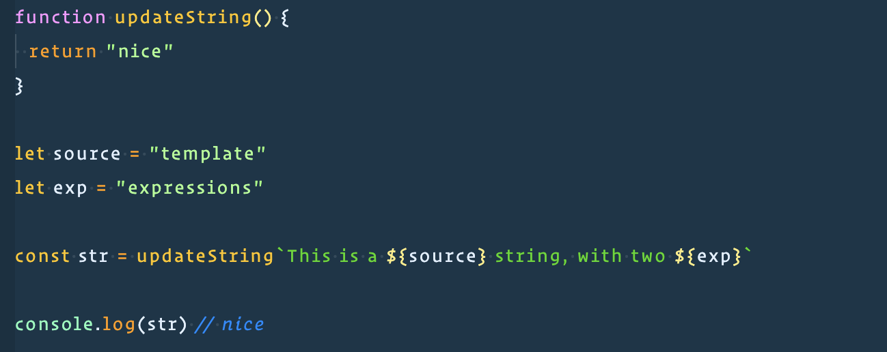
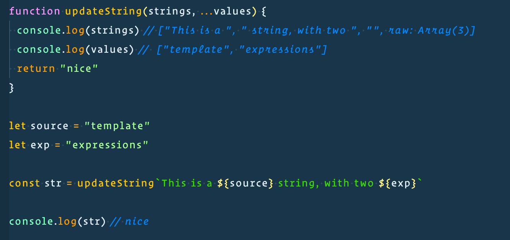
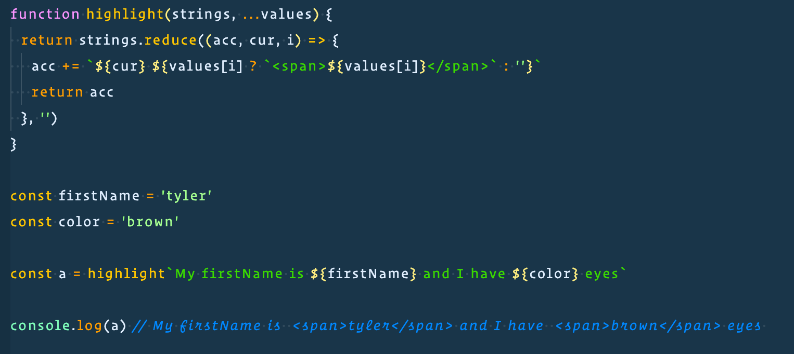
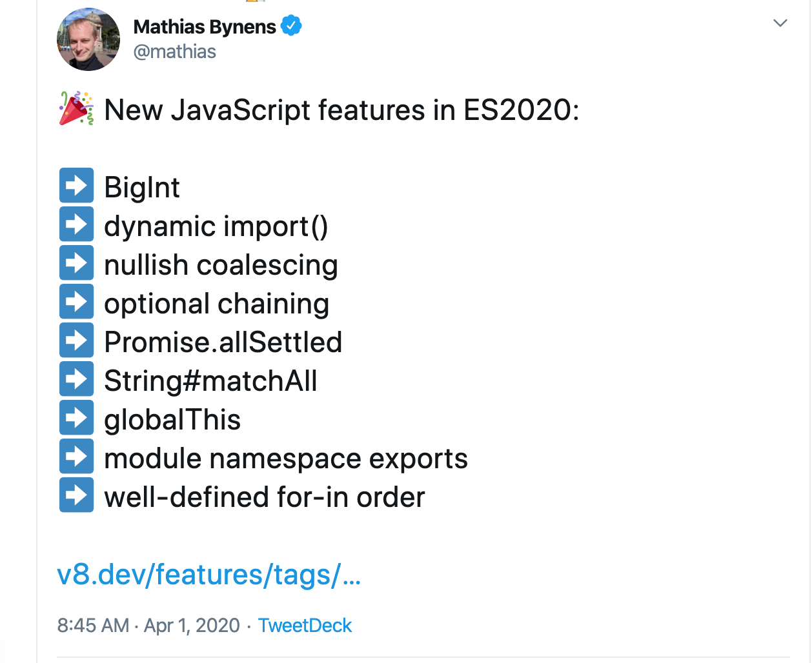

import { CodeSurferLayout } from "code-surfer";
import "./index.css";
import Footer from "components/Footer/index.js";
import Title from "components/Title/index.js";
import Img from "components/Img.js";

export const themes = [
  {
    colors: {
      text: "#000",
      background: "#fff",
      primary: "#0af",
      black: "#000",
    },
    fontWeights: {
      heading: 600,
      bold: 600,
    },
    text: {
      heading: {
        textTransform: "uppercase",
        letterSpacing: "0.1em",
      },
    },
    styles: {
      pre: {
        color: "primary",
        bg: "black",
      },
      code: {
        color: "primary",
      },
    },
  },
];

<div style={{marginLeft: '65px'}}>

<Title text="ES8, ES9, ES10+… Let’s explore JavaScript’s exciting new features">

</Title>

<p style={{ marginTop: "75px" }}> MagnoliaJS, 2020 </p>

 </div>

---

<Title text="About me" />

- Developer Advocate Engineer at <em>Auth0</em>
- <em>egghead.io</em> instructor
- Catch me on <em>tylerclark.dev</em>
- Live streaming on <em>twitch.tv/livewithtyler</em>

<Footer />

---

<Title text="What this talk is" />

- Review JS edition releases
- Discuss current JS features you <em>might not be aware of</em>
- Talk about features <em>looking to come out soon</em>

<Footer />

---

<Title text="JS Buzzwords" />

- <em>ECMAScript</em>: Or "ES", is a scripting-language specification
  standardized by Ecma International (1994).
- <em>Edition</em>: (ECMAScript + edition-year) or (ES + edition-number) or (ES
  + edition-year)
- <em>TC39</em>: Short for technical committee 39. This committee controls the
  evolution of JS. They meet on a regular basis and minutes are recorded.
- <em>Stages (0 - 4)</em>: Proposals for new JS features have to go through
  "stages" before added.

<Footer />

---

<Title text="The Evolution of JS" />

<br />
<br />

<p>
  <em>Edition 1 (1997)</em> -> First Edition
</p>
<hr />
<p>
  <em>Edition 2 (1998)</em> -> Editorial changes
</p>
<hr />
<p>
  <em>Edition 3 (1999) </em>-> Regex, try / catch, better Errors, etc.
</p>
<hr />
<p>
  <em>Edition 4 (2003)</em> -> Abandoned (some features added to version 6)
</p>
<hr />
<p>
  <em>Edition 5 (2009) </em>-> strict mode, getters, setters,
</p>
<hr />
<p>
  <em>Edition 6 (2015)</em> -> 🔥 Explosion of new stuff 🔥
</p>
<hr />

<Footer />

---

<Title text="ES6" />

<div style={{ display: "flex", justifyContent: "space-around" }}>
  <div>
    <ul>
      <li> let & const </li>
      <li> spread & rest operators </li>
      <li> Generators </li>
      <li> Classes </li>
      <li> Promises </li>
    </ul>
  </div>
  <div>
    <ul>
      <li> Arrow functions </li>
      <li> Map & Set </li>
      <li> Proxies </li>
      <li> Default Params </li>
      <li> Template strings </li>
      <li> Tons more! </li>
    </ul>
  </div>
</div>

<Footer />

---

<h3 style={{ textAlign: "center" }}>

  <em>It was too much</em>
</h3>

<Footer />

---

<Title text="A needed change" />

- Smaller, more frequent releases

<Footer />

---

<Title text="What did I miss?"></Title>

ES7 (2016) -> [].includes(), Exponentiation operator (\*\*)

<hr />
ES8 (2017) -> Async functions
<hr />
ES9 (2018) -> Async iteration, new RegExp stuff, Promise.prototype.finally()
<hr />
ES10 (2019) -> Array flat() & flatMap(), Object.fromEntries(), String trimStart /
End
<hr />
ES11 (2020) -> Coalescing ??, Optional ?., dynamic import()
<hr />

<Footer />

---

<Title text="First up 🍎"></Title>

- Array.prototypetype.includes()
- Exponentiation operator
- Promise.prototypetype.finally()
- Tagged template literal

<Footer />

---

<CodeSurferLayout>

```js title="ES7: Includes"
["Tom", "Nacy", "Drew", "Stacy"].indexOf("Drew") > -1;
```

```js title="ES7: Includes"
["Tom", "Nacy", "Drew", "Stacy"].includes("Drew"); // true
```

```js title="ES7: Includes"
["Tom", "Nacy", "Drew", NaN].includes(NaN); // true

// .indexOf does not work in this scenario
```

```js title="ES7: Includes"
["Tom", "Nacy", "Drew", "Stacy"].includes("Tom", 1); // false

// .indexOf would need to slice an array
```

</CodeSurferLayout>

---

<CodeSurferLayout>

```js title="ES7: Math.pow"
Math.pow(2, 3); // 8
```

```js title="ES7: **"
2 ** 3; // 8
```

  </CodeSurferLayout>

---

<CodeSurferLayout>

```js title="ES8: Promise.prototype.finally()"
const state = {
  isLoading: true,
};

fetch(request).then((d) => {
  state.isLoading = false;
  return d.json();
});
```

```js title="ES8: finally()"
const state = {
  isLoading: true,
};

fetch(request)
  .then((d) => d.json())
  .catch((e) => console.log(e))
  .finally(() => {
    state.isLoading = false;
    // clean up code
  });
```

  </CodeSurferLayout>

---

<div style={{textAlign: 'center'}}>
<div>
  <em>Tagged template literal ES7 </em>
</div>


</div>
<Footer />

---

<div style={{textAlign: 'center'}}>
<div>
  <em>Tagged template literal ES7 </em>
</div>



</div>

<Footer />

---

<div style={{textAlign: 'center'}}>

<div>
  <em>Tagged template literal ES7 </em>
</div>



</div>

<Footer />

---

<div style={{textAlign: 'center'}}>
<div>
  <em>Tagged template literal ES7 </em>
</div>


</div>

<Footer />

---

<Title text="Help from friends "></Title>

- Array.prototype.flat
- Object.fromEntries

<Footer />

---


<Footer />

---

  <CodeSurferLayout>

```js title="Array.prototype.flat()"
const list = [1, 2, [3, 4]];

list.flat(); // [1, 2, 3, 4]
```

  </CodeSurferLayout>

---


<Footer />

---

<CodeSurferLayout>

```js title="Object.entries"
const obj = { foo: "bar", baz: 42 };

console.log(Object.entries(obj));

// [ ['foo', 'bar'], ['baz', 42] ]
```

```js title="Object.keys"
const anObj = { 100: "a", 2: "b", 7: "c" };

console.log(Object.keys(anObj));

// ['2', '7', '100']
```

```js title="Object.keys"
const anObj = { 100: "a", 2: "b", 7: "c" };

Object.keys(anObj).forEach((o) => {
  // do something with properties
});
```

  </CodeSurferLayout>

---


<Footer />

---

<CodeSurferLayout>

```js 1 title="Object.fromEntries"
const itemsToCount = ["pants", "socks", "shoes", "hats"];

Object.fromEntries(itemsToCount.map((item) => [item, 0]));

// {pants: 0, socks: 0, shoes: 0, hats: 0}
```

```js 3 title="Object.fromEntries"
const itemsToCount = ["pants", "socks", "shoes", "hats"];

Object.fromEntries(itemsToCount.map((item) => [item, 0]));

// {pants: 0, socks: 0, shoes: 0, hats: 0}
```

```js 5 title="Object.fromEntries"
const itemsToCount = ["pants", "socks", "shoes", "hats"];

Object.fromEntries(itemsToCount.map((item) => [item, 0]));

// {pants: 0, socks: 0, shoes: 0, hats: 0}
```

  </CodeSurferLayout>

---

<div>
  
</div>

<Footer />

---

<CodeSurferLayout>

```js title="Dynamic import"
const main = document.querySelector("main");
for (const link of document.querySelectorAll("nav > a")) {
  link.addEventListener("click", (e) => {
    e.preventDefault();

    import("./section-modules/" + link.dataset.entryModule + ".js")
      .then((module) => {
        module.loadPageInto(main);
      })
      .catch((err) => {
        main.textContent = err.message;
      });
  });
}
```

```js 6 title="Dynamic import"
const main = document.querySelector("main");
for (const link of document.querySelectorAll("nav > a")) {
  link.addEventListener("click", (e) => {
    e.preventDefault();

    import("./section-modules/" + link.dataset.entryModule + ".js")
      .then((module) => {
        module.loadPageInto(main);
      })
      .catch((err) => {
        main.textContent = err.message;
      });
  });
}
```

```js 7 title="Dynamic import"
const main = document.querySelector("main");
for (const link of document.querySelectorAll("nav > a")) {
  link.addEventListener("click", (e) => {
    e.preventDefault();

    import("./section-modules/" + link.dataset.entryModule + ".js")
      .then((module) => {
        module.loadPageInto(main);
      })
      .catch((err) => {
        main.textContent = err.message;
      });
  });
}
```

```js 8 title="Dynamic import"
const main = document.querySelector("main");
for (const link of document.querySelectorAll("nav > a")) {
  link.addEventListener("click", (e) => {
    e.preventDefault();

    import("./section-modules/" + link.dataset.entryModule + ".js")
      .then((module) => {
        module.loadPageInto(main);
      })
      .catch((err) => {
        main.textContent = err.message;
      });
  });
}
```

  </CodeSurferLayout>

---

<CodeSurferLayout>

```js title="Nullish Coalescing ??"
const someNumber = 42;

console.log(someNumber || "Right side"); // 42

console.log(someNumber ?? "Right side"); // 42
```

```js title="Nullish Coalescing ??"
const nullValue = null;

console.log(nullValue || "Right side"); // 'Right side'

console.log(nullValue ?? "Right side"); // 'Right side'
```

```js title="Nullish Coalescing ??"
const emptyText = "";

console.log(emptyText || "Right side"); // 'Right side'

console.log(emptyText ?? "Right side"); // ""
```

```js title="Nullish Coalescing ??"
const zero = 0;

console.log(zero || "Right side"); // 'Right side'

console.log(zero ?? "Right side"); // 0
```

```js title="Nullish Coalescing ??"

null || undefined ?? "foo"; // raises a SyntaxError

(null || undefined) ?? "foo"; // returns "foo"

```

</CodeSurferLayout>

---

<CodeSurferLayout>

```js title="Optional Chaining ?."
const name = props && props.data && props.data.firstName;
```

```js title="Optional Chaining ?."
const name = props?.data?.firstName;

// undefined if anything doesn't exist
```

```js title="Optional Chaining ?."
const myName = "tyler";

const name = props?.data?.[myName];

// undefined if anything doesn't exist
```

```js title="Optional Chaining ?."
const name = props?.onClick?.();

// undefined if anything doesn't exist
```

</CodeSurferLayout>

---

<Title text="Promise combinators " />

- Promise.all (<em>ES2015</em>) vs. Promise.allSettled (<em>ES2020</em>)
- Promise.race (<em>ES2015</em>) vs. Promise.any (<em>proposal</em>)

<Footer />

---

<CodeSurferLayout>

```js title="Promise.all"
const urls = [
  fetch("./styles-a.css"),
  fetch("./styles-a.css"), // errors out
];

const stylesResponses = await Promise.all(urls);

// All are fulfilled, OR as soon as one rejects
```

```js title="Promise.allSettled"
const urls = [
  fetch("./styles-a.css"),
  fetch("./styles-a.css"), // errors out
];

const stylesResponses = await Promise.allSettled(urls);

// All are fulfilled, regardless of success or failure
```

```js title="Promise.race"
const urls = [
  fetch("./styles-a.css"),
  fetch("./styles-a.css"), // errors out
];

const stylesResponses = await Promise.race(urls);

// First promise that is a success or rejection
```

```js title="Promise.any"
const urls = [
  fetch("./styles-a.css"),
  fetch("./styles-a.css"), // errors out
];

const stylesResponses = await Promise.any(urls);

// First prmoise that is a success or when all are rejected
```

</CodeSurferLayout>

---

<Title text="Module namespace exports" />

- Adds one additonal export module option

<Footer />

---

<CodeSurferLayout>

```js
export { x } from "./file.js";
export { x as v } from "./file.js";
export * from "./file.js";
```

```js
export { x } from "./file.js";
export { x as v } from "./file.js";
export * from "./file.js";

export * as newName from "./file.js";
```

  </CodeSurferLayout>

---

<Title text="Let's look at the future: stage 3" />

- Private class methods and fields
- Top level await
- Logical Assignment
- (Promise.any)

<Footer />

---

  <CodeSurferLayout>

```js title="Private class variables"
class Animal {
  static lastName = "Clark";
  firstName = "Russ";
}

Animal.lastName; // "Clark"
Animal.firstName; // undefined
```

```js title="Private class variables"
class Animal {
  static lastName = "Clark";
  firstName = "Russ";
}

const dog = new Animal();

dog.lastName; // undefined
dog.firstName; // "Russ"
```

```js title="Private class variables"
class Animal {
  static lastName = "Clark";
  firstName = "Russ";
  #middleName = "Ray";
}

const dog = new Animal();

Animal.middleName; // undefined
dog.middleName; // undeinfed
dog.#middleName; // Error: Private field only within class
```

```js title="Private class variables"
class Animal {
  static lastName = "Clark";
  firstName = () => this.#middleName;
  #middleName = "Ray";
}

const dog = new Animal();

Animal.firstName(); // undefined
dog.firstName(); // "Ray"
```

  </CodeSurferLayout>

---

   <CodeSurferLayout>

```js title="Top level await"
(async function () {
  await Promise.resolve(console.log("It works"));
  // It works
})();
```

```js 3:4 title="Top level await"
await Promise.resolve(console.log("It works"));
// It works
```

```js title="Top level await"
let jQuery;
try {
  jQuery = await import("https://cdn-a.example.com/jQuery");
} catch {
  jQuery = await import("https://cdn-b.example.com/jQuery");
}
```

  </CodeSurferLayout>

---

<Title text="Top level await gotchas " />

- Can't go in "main" JS program, only modules
- Can cause issues with dynamic imports. Potential deadlocks?
- Module execution order behavior changes with await
- [More info](https://v8.dev/features/top-level-await)

<Footer />

---

   <CodeSurferLayout>

```js title="Logical Assignment"
let a = 2;

a += 2;
```

```js title="Logical Assignment"
let a;
let b = 2;

a ||= b;

// a || (a = b)

// a === 2
```

```js title="Logical Assignment"
let a = null;
let b = 2;

a &&= b;

// a && (a = b)

// a === null
```

```js title="Logical Assignment"
let a = null;
let b = 2;

a ??= b;

// a ?? (a = b)

// a === 2
```

  </CodeSurferLayout>

---

<p style={{ textAlign: "center" }}>
  <em>Many stage 0 -2 proposals</em>
</p>

<Footer />

---

<Title text="Recap" />

<div style={{ display: "flex", justifyContent: "space-around" }}>
  <div>
    <ul>
      <li> Array.prototypetype.includes() </li>
      <li> Exponentiation operator </li>
      <li> Promise.prototypetype.finally() </li>
      <li> Tagged template literal </li>
      <li> Array.prototype.flat </li>
      <li> Object.fromEntries </li>
      <li> Dynamic import </li>
    </ul>
  </div>
  <div>
    <ul>
      <li> Nullish Coalescing </li>
      <li> Optional Chaining </li>
      <li> Promise.allSettled </li>
      <li> Promise.any </li>
      <li> Module namespace exports </li>
      <li> Private class methods and fields </li>
      <li> Top level await </li>
      <li> Logical Assignment </li>
    </ul>
  </div>
</div>

<Footer />

---

<Title text="Thanks!" />

<Footer />
